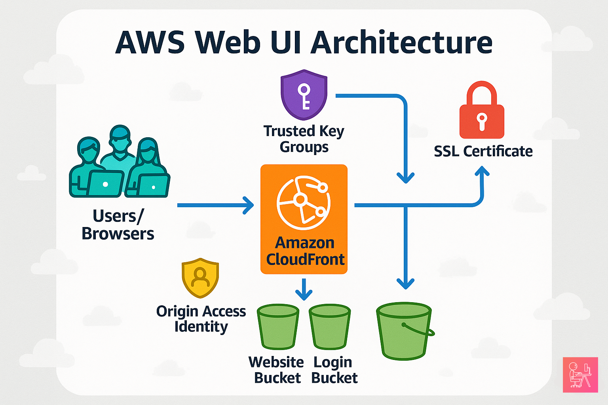

# AWS Web UI Infrastructure

A secure, scalable AWS CDK TypeScript project for deploying web applications with advanced authentication, optimized caching, and multi-origin content delivery.

## 🏗️ Architecture Overview

<p align="center">
  
  <br />
  <i>Figure I - Base Web UI Architecture</i>
</p>

This project deploys a sophisticated web UI infrastructure using:

- **Amazon S3** for static website hosting and login page storage
- **Amazon CloudFront** for global content delivery with custom caching policies
- **Origin Access Identity** for secure S3 access
- **Trusted Key Groups** for signed URL authentication
- **SSL/TLS** encryption with custom domain support
- **Multiple authentication methods** (standard, apps-based, ETH-based)

## ✨ Key Features

- 🔐 **Secure Authentication**: Multiple login methods with signed URL protection
- ⚡ **Optimized Performance**: Intelligent caching strategies for different content types
- 🌍 **Global Distribution**: CloudFront edge locations for low-latency access
- 🔒 **HTTPS Enforcement**: Automatic redirect and secure content delivery
- 📱 **SPA Support**: Single Page Application routing with proper error handling
- 🎯 **Multi-Origin Setup**: Separate buckets for website content and authentication pages

## 📋 Prerequisites

Before deploying this infrastructure, ensure you have:

- **AWS CLI** configured with appropriate permissions
- **Node.js** (v18 or later) and npm installed
- **AWS CDK** v2.x installed globally (`npm install -g aws-cdk`)
- **Valid SSL certificate** in AWS Certificate Manager
- **Public key** for signed URL authentication uploaded to CloudFront
- **Existing login bucket** (if using separate authentication infrastructure)

## 🚀 Quick Start

### 1. Installation

```bash
# Clone the repository
git clone <repository-url>
cd aws-web-ui

# Install dependencies
npm install

# Build the project
npm run build
```

### 2. Configuration

Configure the required parameters in `bin/aws-web-ui.ts`:

```typescript
new NerdiylandWebUi(app, 'NerdiylandWebUi', {
  certificateArn: 'arn:aws:acm:us-east-1:123456789012:certificate/your-cert-id',
  loginBucketName: 'your-login-bucket-name',
  originAccessIdentityCanonicalUserId: 'your-oai-canonical-user-id',
  originAccessIdentityName: 'your-oai-name',
  viewersPublicKeyId: 'your-public-key-id',
  deliveryAliases: ['www.yourdomain.com', 'yourdomain.com'], // Optional
});
```

### 3. Deployment

```bash
# Synthesize CloudFormation template (optional, for review)
npx cdk synth

# Deploy to AWS
npx cdk deploy

# To deploy with confirmation prompts disabled
npx cdk deploy --require-approval never
```

## ⚙️ Configuration Reference

### Required Parameters

| Parameter | Type | Description |
|-----------|------|-------------|
| `certificateArn` | string | ARN of SSL certificate in AWS Certificate Manager |
| `loginBucketName` | string | S3 bucket name containing authentication pages |
| `originAccessIdentityCanonicalUserId` | string | Canonical user ID of the Origin Access Identity |
| `originAccessIdentityName` | string | Name of the existing Origin Access Identity |
| `viewersPublicKeyId` | string | CloudFront public key ID for signed URLs |

### Optional Parameters

| Parameter | Type | Description |
|-----------|------|-------------|
| `deliveryAliases` | string[] | Custom domain names for the distribution |

## 🔧 Architecture Components

### Main Stack (`NerdiylandWebUi`)
- Entry point for the CDK application
- Orchestrates the WebUI construct with configuration
- Manages stack-level properties and outputs

### WebUI Construct
- **S3 Website Bucket**: Primary storage for web application files
- **CloudFront Distribution**: Global content delivery with custom behaviors
- **Cache Policies**: Optimized TTL settings for different content types
- **Security Groups**: Trusted key groups for authenticated access

### Authentication Flow
- **Standard Login**: `/login.html` for regular user authentication
- **Apps Login**: `/apps-login.html` for application-specific authentication  
- **ETH Login**: `/eth-login.html` for Ethereum-based authentication
- **IDP Response**: `/idpresponse.html` and `/apps-idpresponse.html` for identity provider callbacks

## 🎯 Caching Strategy

The infrastructure implements intelligent caching policies:

### Short-Term Cache (5 minutes)
- HTML pages and dynamic content
- Authentication pages
- Default root object (`index.html`)

### Long-Term Cache (1-3 years)
- Static assets (`/css/*`, `/js/*`, `/assets/*`)
- Vendor chunks and libraries
- Images and fonts

### Cache Behaviors
- **Authenticated Content**: Requires trusted key group signatures
- **Public Content**: Vendor files and public assets
- **Error Handling**: 404 → index.html, 403 → login page

## 🔒 Security Features

### Origin Access Identity
- Restricts direct S3 access
- Ensures all traffic flows through CloudFront
- Maintains bucket privacy while enabling distribution

### Trusted Key Groups
- Implements signed URL authentication
- Protects sensitive application content
- Allows selective access to resources

### HTTPS Enforcement
- Automatic HTTP to HTTPS redirection
- TLS 1.2+ encryption for all communications
- Secure content delivery policies

## 📁 File Structure

```
aws-web-ui/
├── bin/
│   └── aws-web-ui.ts          # CDK app entry point
├── lib/
│   ├── nerdiyland-web-ui-stack.ts  # Main stack definition
│   └── web-ui.ts              # WebUI construct
├── test/
│   └── aws-web-ui.test.ts     # Unit tests
├── docs/                      # Documentation (generated)
├── package.json               # Dependencies and scripts
└── README.md                  # This file
```

## 🧪 Testing

```bash
# Run unit tests
npm test

# Run tests in watch mode
npm run test -- --watch

# Generate coverage report
npm run test -- --coverage
```

## 🚨 Troubleshooting

### Common Issues

**Certificate not found**: Ensure the certificate ARN is correct and the certificate is in the `us-east-1` region (required for CloudFront).

**Origin Access Identity errors**: Verify the OAI exists and the canonical user ID is correct.

**Public key not found**: Confirm the public key is uploaded to CloudFront and the ID is accurate.

**Deployment failures**: Check AWS credentials and permissions for CDK operations.

### Useful Commands

```bash
# Check CDK version
cdk --version

# List all stacks
cdk list

# Compare deployed stack with current state
cdk diff

# Destroy the stack (be careful!)
cdk destroy
```

## 🤝 Contributing

1. Fork the repository
2. Create a feature branch (`git checkout -b feature/amazing-feature`)
3. Commit your changes (`git commit -m 'Add amazing feature'`)
4. Push to the branch (`git push origin feature/amazing-feature`)
5. Open a Pull Request

## 📄 License

This project is licensed under the [Creative Commons License 4.0 NC SA](https://creativecommons.org/licenses/by-nc-sa/4.0/) - see the [LICENSE](LICENSE) file for details.

## 🆘 Support

For issues and questions:
- Check the [troubleshooting section](#-troubleshooting)
- Review the [documentation](docs/)
- Open an issue in the repository

---

**Built with AWS CDK** | **Powered by TypeScript** | **Secured by CloudFront**
